# Nord Markdown Preview

A Markdown preview extension supporting YAML metadata, Mermaid diagrams, Math rendering, Tab Groups, Checkboxes, YouTube, Vimeo, and image scaling, with the ability to export as PDF or HTML.

**Table of Contents**

- [Nord Markdown Preview](#nord-markdown-preview)
  - [Features](#features)
    - [Export as PDF and Html](#export-as-pdf-and-html)
    - [Light / Dark Mode](#light--dark-mode)
    - [Math](#math)
    - [Youtube Video](#youtube-video)
    - [Vimeo Video](#vimeo-video)
    - [Local Video](#local-video)
    - [Mermaid](#mermaid)
    - [YAML Metadata](#yaml-metadata)
    - [Headings](#headings)
    - [Header Sync](#header-sync)
    - [Inline Formatting](#inline-formatting)
    - [Code Blocks with Syntax Highlighting](#code-blocks-with-syntax-highlighting)
    - [Tables](#tables)
    - [Task List](#task-list)
    - [Image Scale](#image-scale)
    - [Admonitions](#admonitions)
    - [Tab Groups](#tab-groups)
    - [Buttons](#buttons)
  - [Usage](#usage)
  - [Installation](#installation)


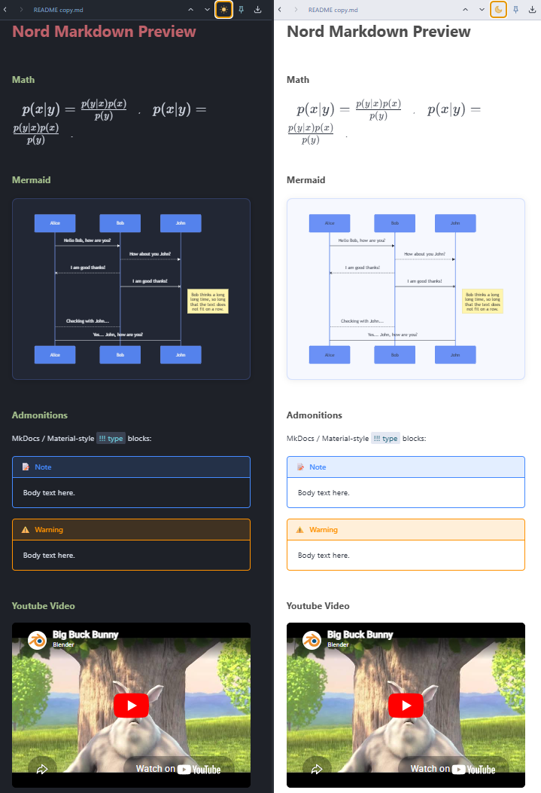

## Features


### Export as PDF and Html

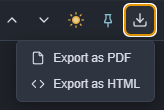


### Light / Dark Mode 

Click the Sun and Moon icon on the toolbar to switch the Light And Dark Theme.


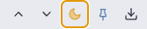


### Math

Inline and block math via `$...$` and `\(...\)` syntax (requires MathJax/KaTeX in the render pipeline):


```markdown
$p(x|y) = \frac{p(y|x)p(x)}{p(y)}$, \(p(x|y) = \frac{p(y|x)p(x)}{p(y)}\).

```

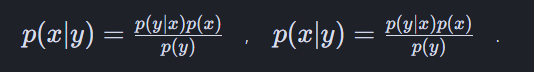


### Youtube Video

- Right-click on the YouTube video
- Click **Copy embed code**
- Paste it into the MkDocs `.md` file

A Maximize button is available in the top-right corner of the embedded video.


```
<iframe width="650" height="450" src="https://www.youtube.com/embed/YE7VzlLtp-4" frameborder="0" allow="accelerometer; autoplay; clipboard-write; encrypted-media; gyroscope; picture-in-picture" allowMaximize></iframe>
```


### Vimeo Video

A Maximize button is available in the top-right corner of the embedded video.

```
<iframe title="vimeo-player" src="https://player.vimeo.com/video/1084537?h=b1b3ab5aa2" width="640" height="360" frameborder="0" referrerpolicy="strict-origin-when-cross-origin" allow="autoplay; fullscreen; picture-in-picture; clipboard-write; encrypted-media; web-share"   allowfullscreen></iframe>
```

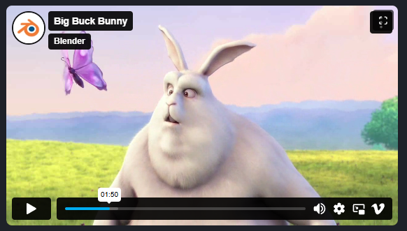


### Local Video

```
<video controls src="../sources/videos/big_buck_bunny.mp4" width=70%></video>
```


### Mermaid

`````
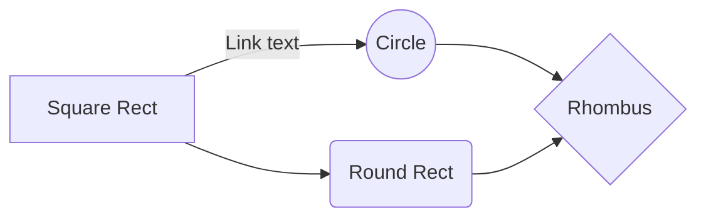
`````

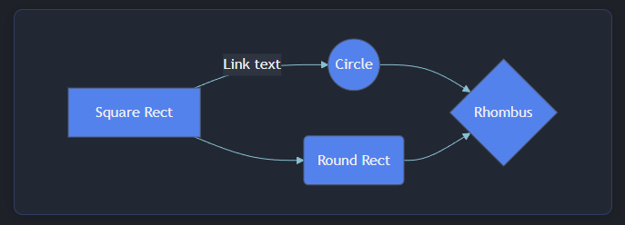


`````
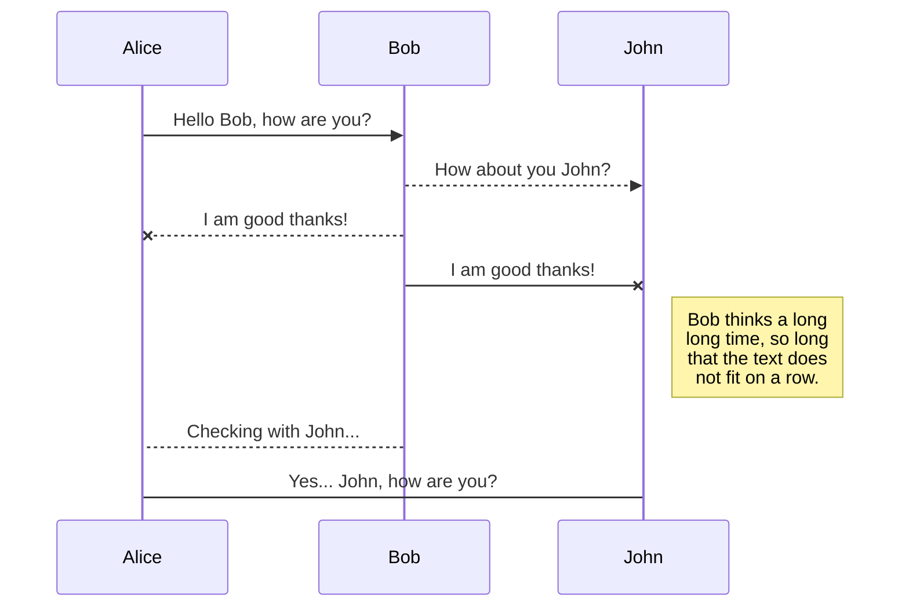
`````

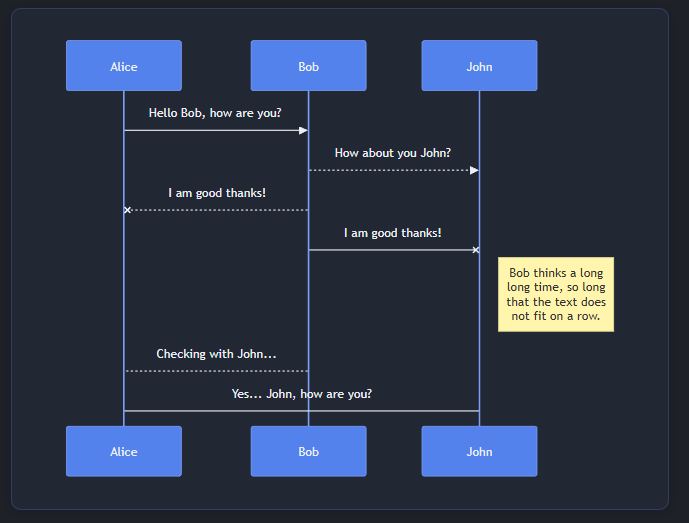


### YAML Metadata

Metadata blocks at the top of a file are rendered as a styled metadata table.

```markdown
---
title: My Document
author: Author
tags:
  - markdown
  - document
---
```

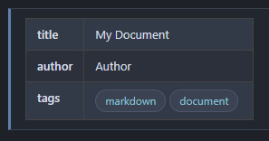


### Headings

```

# H1
## H2
### H3
#### H4
##### H5
##### H6

```

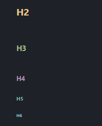


### Header Sync

Click any heading to sync the scroll position between the editor and preview.


### Inline Formatting

```markdown
*italic*  _italic_
**bold**  __bold__
**bold with _nested italic_**
<del>strikethrough</del>
<mark>highlighted text</mark>
`inline code`
```

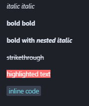


### Code Blocks with Syntax Highlighting

Fenced code blocks are highlighted using the One Dark Pro palette (via highlight.js).

````markdown
```python
def read_from_file(path):
    with open(path) as f:
        return f.read()
```
````

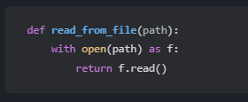


Supported languages include Python, JavaScript, Ruby, C, C++, C#, Bash, and more.


### Tables

```markdown
| header 1 | header 2 | header 3 |
| :------- | :------: | -------: |
| cell 1   |  cell 2  |   cell 3 |
```

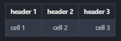

Alternating row stripes and hover highlight included.


### Task List

```markdown
- [x] item 1
    * [x] item A
    * [ ] item B
        + [x] item a
        + [ ] item b
```

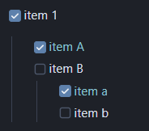


Checked items are rendered with a strikethrough in Nord cyan.


### Image Scale

Standard syntax plus Kramdown-style attribute blocks for resizing:

```markdown

{: style="height:100px;width:100px"}

```

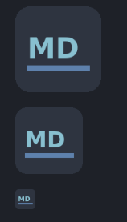


### Admonitions

MkDocs / Material-style `!!! type` blocks:

Supported types: `note`, `abstract`, `info`, `tip`, `success`, `question`, `warning`, `failure`, `danger`, `bug`, `example`, `quote`

```markdown
!!! note
    Body text here.

!!! warning "Custom Title"
    Body text here.
```


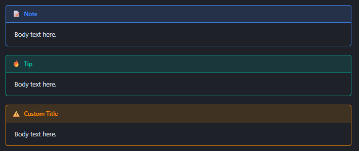


### Tab Groups

MkDocs `===` tab syntax:

```markdown

=== "C"

    ``` c
    #include <stdio.h>

    int main(void) {
      printf("Hello world!\n");
      return 0;
    }
    ```

=== "C++"

    ``` c++
    #include <iostream>

    int main(void) {
      std::cout << "Hello world!" << std::endl;
      return 0;
    }
    ```

=== "Python"

    ```python
    def main():
        print("Hello World!")
        return 0
    ```
```

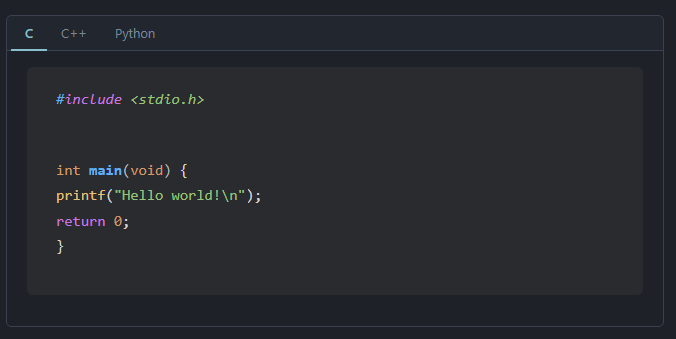


### Buttons

```markdown
[Label](url){ .md-button }
[Label](url){ .md-button .md-button--primary }
```

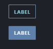


## Usage

Open any `.md` file and press `Ctrl+Shift+V` (`Cmd+Shift+V` on Mac) to open the split preview panel.

The preview icon also appears in the editor title bar and right-click context menus for `.md` files.


## Installation

1. Download the `.vsix` file
2. In VSCode: **Extensions** → `···` menu → **Install from VSIX…**
3. Select the downloaded file and reload
