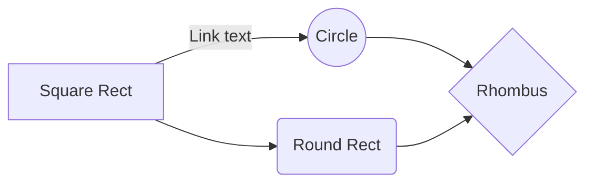
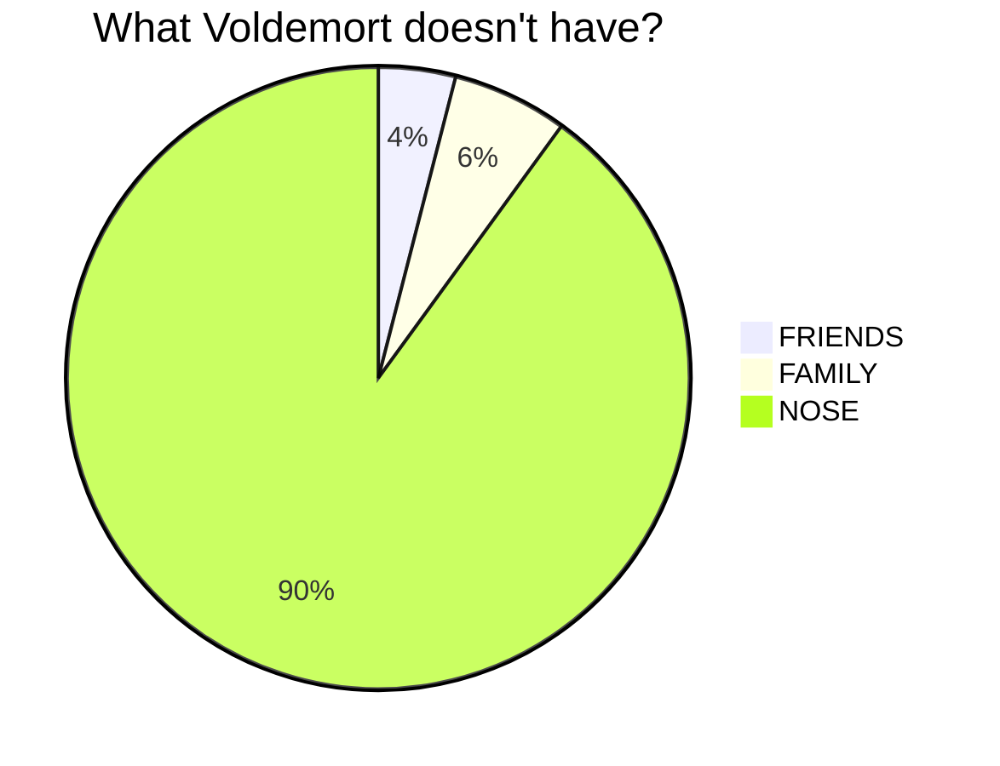
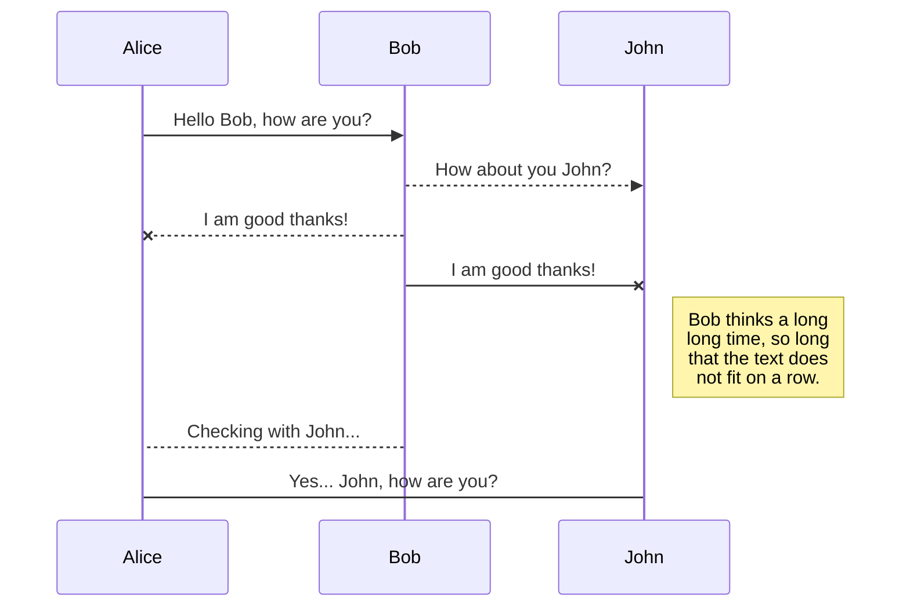
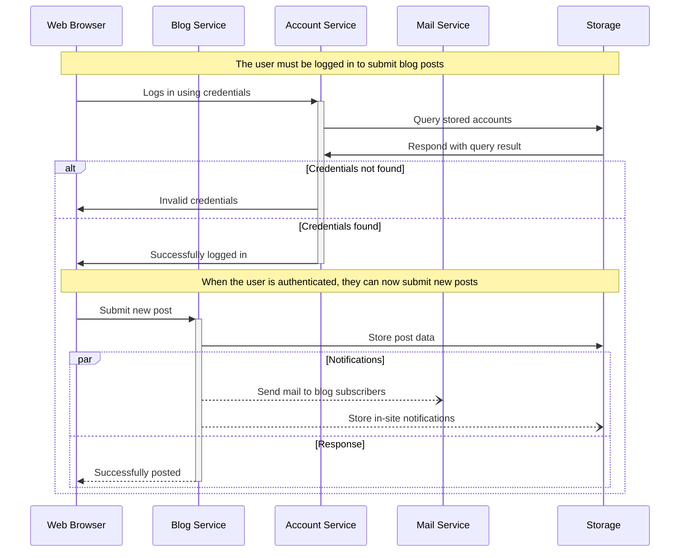

# Markdown Example

- [Markdown Example](#markdown-example)
- [Markdown](#markdown)
  - [H2](#h2)
    - [H3](#h3)
      - [H4](#h4)
        - [H5](#h5)
          - [H6](#h6)
  - [Italic](#italic)
  - [Bold](#bold)
  - [Bold with Italic](#bold-with-italic)
  - [Scratch](#scratch)
  - [Mark](#mark)
  - [Link](#link)
      - [big\_buck\_bunny.mp4](#big_buck_bunnymp4)
      - [big\_buck\_bunny.mp4](#big_buck_bunnymp4-1)
  - [Table](#table)
  - [source code](#source-code)
    - [Java](#java)
    - [python](#python)
    - [ruby](#ruby)
    - [text](#text)
    - [grouping code blocks](#grouping-code-blocks)
  - [Task list](#task-list)
  - [Math](#math)
  - [Image](#image)
  - [Youtube Video](#youtube-video)
  - [Vimeo Video](#vimeo-video)
  - [Local Video](#local-video)
  - [Admonition](#admonition)
  - [Tab](#tab)
  - [Mermaid](#mermaid)

```
# Markdown

## H2
### H3
#### H4
##### H5
###### H6
```

# Markdown
## H2
### H3
#### H4
##### H5
###### H6


## Italic

```
Emphasis, aka italics, with *asterisks* or _underscores_.
```

Emphasis, aka italics, with *asterisks* or _underscores_.


## Bold 

```
Strong emphasis, aka bold, with double **asterisks** or __underscores__.
```

Strong emphasis, aka bold, with double **asterisks** or __underscores__.


## Bold with Italic

```
Combined emphasis with **asterisks and _underscores_**.
```

Combined emphasis with **asterisks and _underscores_**.


## Scratch 

```
<del>Scratch this</del>
```

<del>Scratch this</del>


## Mark

```
<mark>mark me</mark>
```

<mark>mark me</mark>


```
- fruit
  - apple
  - orange
  - banana
```

- fruit
  - apple
  - orange
  - banana


```
- `#F00`
- `#F00A`
- `#FF0000`
- `#FF0000AA`
- `RGB(0,255,0)`
- `RGB(0%,100%,0%)`
- `RGBA(0,255,0,0.3)`
- `HSL(540,70%,50%)`
- `HSLA(540,70%,50%,0.3)`
```

- `#F00`
- `#F00A`
- `#FF0000`
- `#FF0000AA`
- `RGB(0,255,0)`
- `RGB(0%,100%,0%)`
- `RGBA(0,255,0,0.3)`
- `HSL(540,70%,50%)`
- `HSLA(540,70%,50%,0.3)`


```
Inline `code` has `back-ticks around` it.
```

Inline `code` has `back-ticks around` it.


## Link

```
[go back to home page](HOME.md)
```

[go back to home page](HOME.md)

<br>

```
<a href="../_sources/videos/big_buck_bunny.mp4" >big_buck_bunny.mp4</a>

```

#### <a href="../_sources/videos/big_buck_bunny.mp4" >big_buck_bunny.mp4</a>


<br>

```
[big_buck_bunny.mp4](../_sources/videos/big_buck_bunny.mp4)

```

#### [big_buck_bunny.mp4](../_sources/videos/big_buck_bunny.mp4)


## Table

```
| header 1 | header 2 | header 3 |
| ---      |  ------  |---------:|
| cell 1   | cell 2   | cell 3   |
| cell 4 | cell 5 is longer | cell 6 is much longer than the others, but that's ok. It will eventually wrap the text when the cell is too large for the display size. |
| cell 7   |          | cell  9 |
```

| header 1 | header 2 | header 3 |
| ---      |  ------  |---------:|
| cell 1   | cell 2   | cell 3   |
| cell 4 | cell 5 is longer | cell 6 is much longer than the others, but that's ok. It will eventually wrap the text when the cell is too large for the display size. |
| cell 7   |          | cell  9 |


## source code


### Java


`````
```javascript
var s = "JavaScript syntax highlighting";
alert(s);
```
`````


```javascript
var s = "JavaScript syntax highlighting";
alert(s);
```


### python

`````
```python
def function():
    #indenting works just fine in the fenced code block
    s = "Python syntax highlighting"
    print s

try:
    from DistUtilsExtra.command import *
except ImportError:
    print >> sys.stderr, 'To build Sphinx-Theme-Brandenburg you need https://launchpad.net/python-distutils-extra'
    sys.exit(1)


def read_from_file(path):
    with open(path) as input:
        return input.read()
```
`````

```python
def function():
    #indenting works just fine in the fenced code block
    s = "Python syntax highlighting"
    print s


try:
    from DistUtilsExtra.command import *
except ImportError:
    print >> sys.stderr, 'To build Sphinx-Theme-Brandenburg you need https://launchpad.net/python-distutils-extra'
    sys.exit(1)


def read_from_file(path):
    with open(path) as input:
        return input.read()

```


### ruby

`````
```ruby
require 'redcarpet'
markdown = Redcarpet.new("Hello World!")
puts markdown.to_html
```
`````

```ruby
require 'redcarpet'
markdown = Redcarpet.new("Hello World!")
puts markdown.to_html
```


### text

`````
```
No language indicated, so no syntax highlighting.
s = "There is no highlighting for this."
But let's throw in a <b>tag</b>.
```
`````


```
No language indicated, so no syntax highlighting.
s = "There is no highlighting for this."
But let's throw in a <b>tag</b>.
```

### grouping code blocks

```

=== "Bash"
    ``` bash
    #!/bin/bash

    echo "Hello world!"
    ```

=== "C"
    ``` c
    #include <stdio.h>

    int main(void) {
      printf("Hello world!\n");
      return 0;
    }
    ```

=== "C++"
    ``` c++
    #include <iostream>

    int main(void) {
      std::cout << "Hello world!" << std::endl;
      return 0;
    }
    ```

=== "C#"
    ``` c#
    using System;

    class Program {
      static void Main(string[] args) {
        Console.WriteLine("Hello world!");
      }
    }
    ```

```


=== "Bash"
    ``` bash
    #!/bin/bash

    echo "Hello world!"
    ```

=== "C"
    ``` c
    #include <stdio.h>

    int main(void) {
      printf("Hello world!\n");
      return 0;
    }
    ```

=== "C++"
    ``` c++
    #include <iostream>

    int main(void) {
      std::cout << "Hello world!" << std::endl;
      return 0;
    }
    ```

=== "C#"
    ``` c#
    using System;

    class Program {
      static void Main(string[] args) {
        Console.WriteLine("Hello world!");
      }
    }
    ```


## Task list

```
- [X] item 1
    * [X] item A
    * [ ] item B
        more text
        + [x] item a
        + [ ] item b
        + [x] item c
    * [X] item C
- [ ] item 2
- [ ] item 3
```


- [X] item 1
    * [X] item A
    * [ ] item B
        more text
        + [x] item a
        + [ ] item b
        + [x] item c
    * [X] item C
- [ ] item 2
- [ ] item 3


## Math

```

$p(x|y) = \frac{p(y|x)p(x)}{p(y)}$, \(p(x|y) = \frac{p(y|x)p(x)}{p(y)}\).

```

$p(x|y) = \frac{p(y|x)p(x)}{p(y)}$, \(p(x|y) = \frac{p(y|x)p(x)}{p(y)}\).


- Reference: 
    - [https://facelessuser.github.io/pymdown-extensions/extensions/arithmatex/](https://facelessuser.github.io/pymdown-extensions/extensions/arithmatex/)


## Image

```

```


```
![alt text1][logo]
[logo]: ball1.gif
```

![alt text1][logo]

[logo]: sources/images/icon.png


use the attr_list extension to change image width and height

```
{: style="height:100px;width:100px"}
```

{: style="height:100px;width:100px"}


html 

```

```


## Youtube Video 

- right click on top of the youtube video 
- click copy embed code
- paste to the mkdocs md file 
- done


```
<iframe width="650" height="450" src="https://www.youtube.com/embed/YE7VzlLtp-4" frameborder="0" allow="accelerometer; autoplay; clipboard-write; encrypted-media; gyroscope; picture-in-picture" allowfullscreen></iframe>

```

<iframe width="650" height="450" src="https://www.youtube.com/embed/YE7VzlLtp-4" frameborder="0" allow="accelerometer; autoplay; clipboard-write; encrypted-media; gyroscope; picture-in-picture" allowfullscreen></iframe>


## Vimeo Video 

```
<iframe title="vimeo-player" src="https://player.vimeo.com/video/1084537?h=b1b3ab5aa2" width="640" height="360" frameborder="0" referrerpolicy="strict-origin-when-cross-origin" allow="autoplay; fullscreen; picture-in-picture; clipboard-write; encrypted-media; web-share"   allowfullscreen></iframe>
```


<iframe title="vimeo-player" src="https://player.vimeo.com/video/1084537?h=b1b3ab5aa2" width="640" height="360" frameborder="0" referrerpolicy="strict-origin-when-cross-origin" allow="autoplay; fullscreen; picture-in-picture; clipboard-write; encrypted-media; web-share"   allowfullscreen></iframe>

## Local Video

```
<video controls src="../_sources/videos/big_buck_bunny.mp4" width=70%></video>
```

<video controls src="../_sources/videos/big_buck_bunny.mp4" width=70%></video>


## Admonition


```
:   !!! note

        Lorem ipsum dolor sit amet, consectetur adipiscing elit. Nulla et
        euismod nulla. Curabitur feugiat, tortor non consequat finibus, justo
        purus auctor massa, nec semper lorem quam in massa.

:   !!! abstract

        Lorem ipsum dolor sit amet, consectetur adipiscing elit. Nulla et
        euismod nulla. Curabitur feugiat, tortor non consequat finibus, justo
        purus auctor massa, nec semper lorem quam in massa.

:   !!! info

        Lorem ipsum dolor sit amet, consectetur adipiscing elit. Nulla et
        euismod nulla. Curabitur feugiat, tortor non consequat finibus, justo
        purus auctor massa, nec semper lorem quam in massa.

:   !!! tip

        Lorem ipsum dolor sit amet, consectetur adipiscing elit. Nulla et
        euismod nulla. Curabitur feugiat, tortor non consequat finibus, justo
        purus auctor massa, nec semper lorem quam in massa.

:   !!! success

        Lorem ipsum dolor sit amet, consectetur adipiscing elit. Nulla et
        euismod nulla. Curabitur feugiat, tortor non consequat finibus, justo
        purus auctor massa, nec semper lorem quam in massa.

:   !!! question

        Lorem ipsum dolor sit amet, consectetur adipiscing elit. Nulla et
        euismod nulla. Curabitur feugiat, tortor non consequat finibus, justo
        purus auctor massa, nec semper lorem quam in massa.

:   !!! warning

        Lorem ipsum dolor sit amet, consectetur adipiscing elit. Nulla et
        euismod nulla. Curabitur feugiat, tortor non consequat finibus, justo
        purus auctor massa, nec semper lorem quam in massa.

:   !!! failure

        Lorem ipsum dolor sit amet, consectetur adipiscing elit. Nulla et
        euismod nulla. Curabitur feugiat, tortor non consequat finibus, justo
        purus auctor massa, nec semper lorem quam in massa.

:   !!! danger

        Lorem ipsum dolor sit amet, consectetur adipiscing elit. Nulla et
        euismod nulla. Curabitur feugiat, tortor non consequat finibus, justo
        purus auctor massa, nec semper lorem quam in massa.

:   !!! bug

        Lorem ipsum dolor sit amet, consectetur adipiscing elit. Nulla et
        euismod nulla. Curabitur feugiat, tortor non consequat finibus, justo
        purus auctor massa, nec semper lorem quam in massa.

:   !!! example

        Lorem ipsum dolor sit amet, consectetur adipiscing elit. Nulla et
        euismod nulla. Curabitur feugiat, tortor non consequat finibus, justo
        purus auctor massa, nec semper lorem quam in massa.

:   !!! quote

        Lorem ipsum dolor sit amet, consectetur adipiscing elit. Nulla et
        euismod nulla. Curabitur feugiat, tortor non consequat finibus, justo
        purus auctor massa, nec semper lorem quam in massa.

```

:   !!! note

        Lorem ipsum dolor sit amet, consectetur adipiscing elit. Nulla et
        euismod nulla. Curabitur feugiat, tortor non consequat finibus, justo
        purus auctor massa, nec semper lorem quam in massa.

:   !!! abstract

        Lorem ipsum dolor sit amet, consectetur adipiscing elit. Nulla et
        euismod nulla. Curabitur feugiat, tortor non consequat finibus, justo
        purus auctor massa, nec semper lorem quam in massa.

:   !!! info

        Lorem ipsum dolor sit amet, consectetur adipiscing elit. Nulla et
        euismod nulla. Curabitur feugiat, tortor non consequat finibus, justo
        purus auctor massa, nec semper lorem quam in massa.

:   !!! tip

        Lorem ipsum dolor sit amet, consectetur adipiscing elit. Nulla et
        euismod nulla. Curabitur feugiat, tortor non consequat finibus, justo
        purus auctor massa, nec semper lorem quam in massa.

:   !!! success

        Lorem ipsum dolor sit amet, consectetur adipiscing elit. Nulla et
        euismod nulla. Curabitur feugiat, tortor non consequat finibus, justo
        purus auctor massa, nec semper lorem quam in massa.

:   !!! question

        Lorem ipsum dolor sit amet, consectetur adipiscing elit. Nulla et
        euismod nulla. Curabitur feugiat, tortor non consequat finibus, justo
        purus auctor massa, nec semper lorem quam in massa.

:   !!! warning

        Lorem ipsum dolor sit amet, consectetur adipiscing elit. Nulla et
        euismod nulla. Curabitur feugiat, tortor non consequat finibus, justo
        purus auctor massa, nec semper lorem quam in massa.

:   !!! failure

        Lorem ipsum dolor sit amet, consectetur adipiscing elit. Nulla et
        euismod nulla. Curabitur feugiat, tortor non consequat finibus, justo
        purus auctor massa, nec semper lorem quam in massa.

:   !!! danger

        Lorem ipsum dolor sit amet, consectetur adipiscing elit. Nulla et
        euismod nulla. Curabitur feugiat, tortor non consequat finibus, justo
        purus auctor massa, nec semper lorem quam in massa.

:   !!! bug

        Lorem ipsum dolor sit amet, consectetur adipiscing elit. Nulla et
        euismod nulla. Curabitur feugiat, tortor non consequat finibus, justo
        purus auctor massa, nec semper lorem quam in massa.

:   !!! example

        Lorem ipsum dolor sit amet, consectetur adipiscing elit. Nulla et
        euismod nulla. Curabitur feugiat, tortor non consequat finibus, justo
        purus auctor massa, nec semper lorem quam in massa.

:   !!! quote

        Lorem ipsum dolor sit amet, consectetur adipiscing elit. Nulla et
        euismod nulla. Curabitur feugiat, tortor non consequat finibus, justo
        purus auctor massa, nec semper lorem quam in massa.


## Tab

```
=== "C"

    ``` c
    #include <stdio.h>

    int main(void) {
      printf("Hello world!\n");
      return 0;
    }
    ```

=== "C++"

    ``` c++
    #include <iostream>

    int main(void) {
      std::cout << "Hello world!" << std::endl;
      return 0;
    }
    ```

=== "Python"

    ```python
    def main():
        print("Hello World!")
        return 0
    ```
```

=== "C"

    ``` c
    #include <stdio.h>

    int main(void) {
      printf("Hello world!\n");
      return 0;
    }
    ```

=== "C++"

    ``` c++
    #include <iostream>

    int main(void) {
      std::cout << "Hello world!" << std::endl;
      return 0;
    }
    ```

=== "Python"

    ```python
    def main():
        print("Hello World!")
        return 0
    ```


```
=== "Sping"
    3 ~ 5

=== "Summer"
    6 ~ 8

=== "Fall"
    9 ~ 11

=== "Winter"
    12 ~ 2
```


=== "Sping"
    3 ~ 5

=== "Summer"
    6 ~ 8

=== "Fall"
    9 ~ 11

=== "Winter"
    12 ~ 2


## Mermaid

`````

`````


<br>

`````

`````


<br>

`````

`````


<br>

`````

`````


<br>


